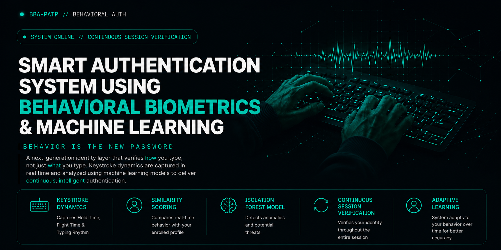
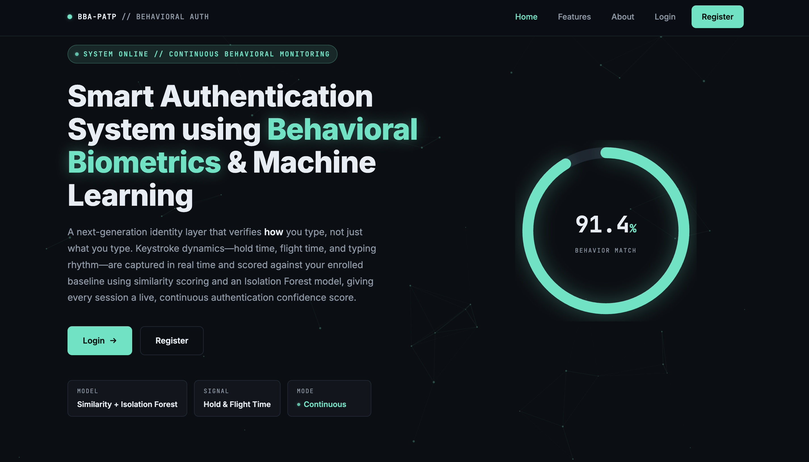
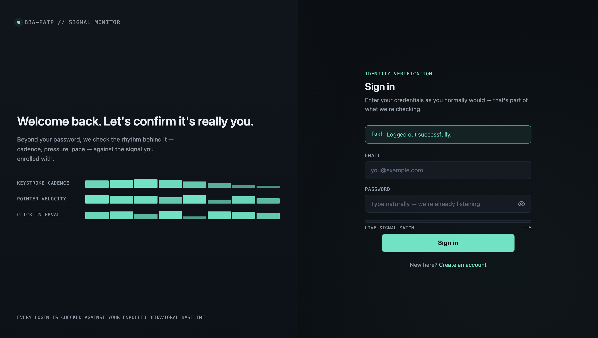
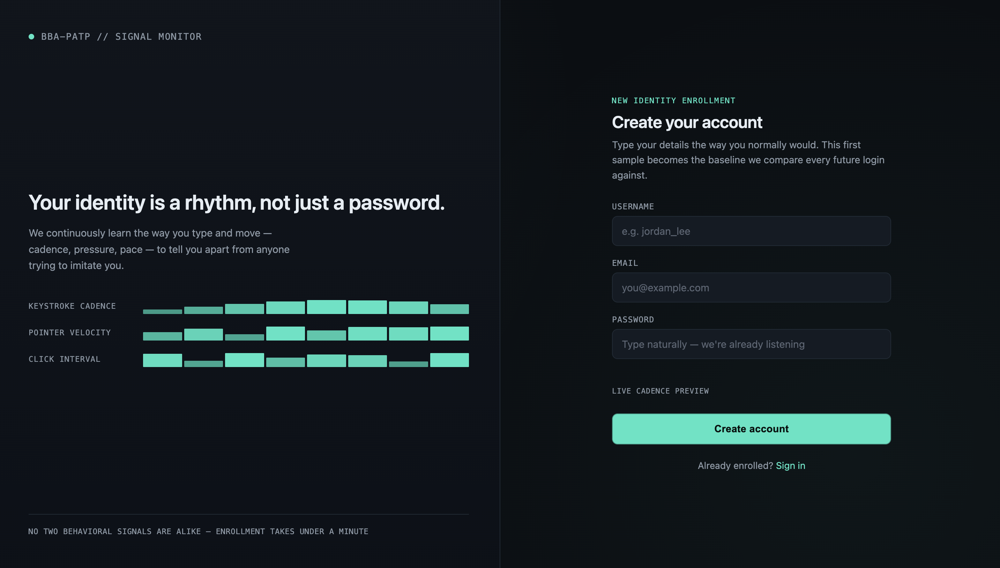
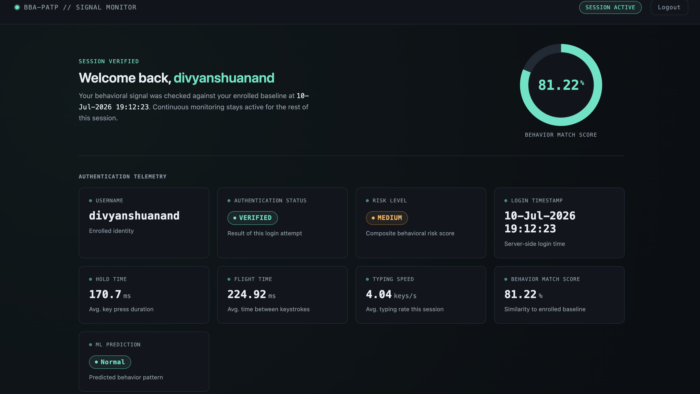
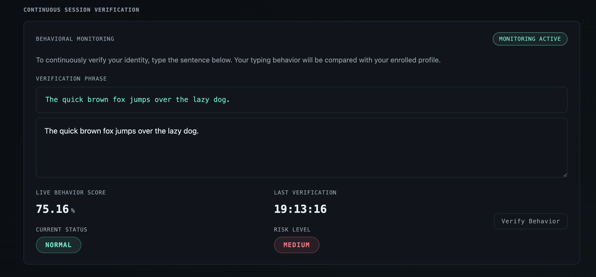
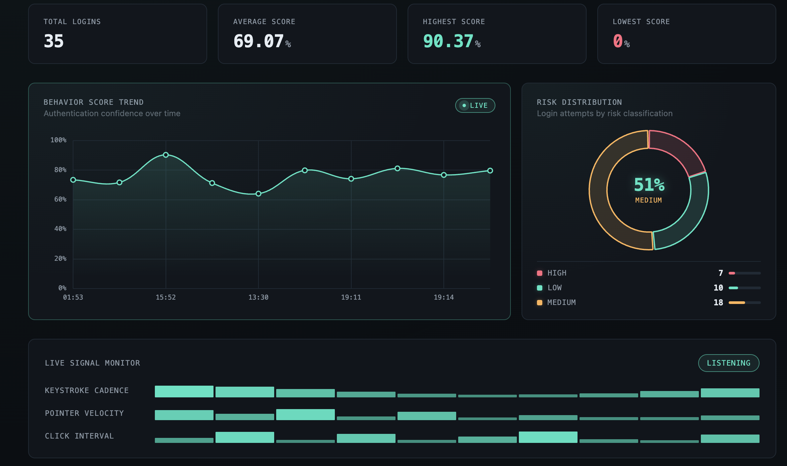
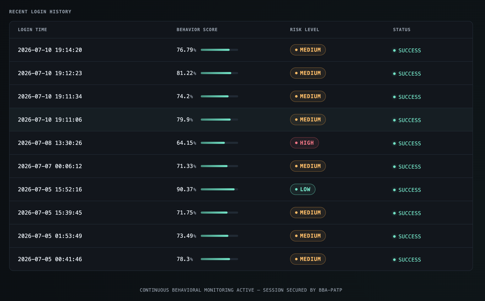

# 🔐 Smart Authentication System using Behavioral Biometrics and Machine Learning

<p align="center">
  
</p>
<p align="center">

A Flask-based behavioral biometric authentication system that strengthens traditional password authentication using **Keystroke Dynamics**, **Behavioral Biometrics**, and **Machine Learning**.

</p>

<p align="center">


</p>

---

## 📖 Project Overview

Traditional authentication systems rely on credentials such as passwords or one-time passwords (OTPs), but these methods verify only **what a user knows**, not **who is actually using the account**. This project strengthens password-based authentication by incorporating **Behavioral Biometrics**, specifically **Keystroke Dynamics**, as an additional layer of security.

The system analyzes a user's typing behavior by extracting features such as **Hold Time**, **Flight Time**, and **Typing Speed** during authentication. These behavioral features are compared with the user's enrolled profile using a behavioral analysis pipeline that combines **Similarity Scoring** and **Isolation Forest Anomaly Detection** to generate a **Behavior Score**. Based on this score, each login session is classified into **Low**, **Medium**, or **High Risk**.

Unlike conventional authentication systems, this project also supports **Continuous Session Verification**, allowing user behavior to be re-evaluated after login. Successful low-risk verification sessions with behavior closely matching the enrolled profile are used for **Adaptive Profile Learning**, enabling the system to gradually adjust to natural changes in the user's typing behavior while maintaining security.

---

# ✨ Key Features

### 🔐 Authentication & Security

- Secure user registration and login
- Password hashing using **bcrypt**
- Behavioral biometric authentication using **Keystroke Dynamics**
- Risk classification (**LOW / MEDIUM / HIGH**)

---

### ⌨️ Behavioral Biometrics

- Hold Time extraction
- Flight Time extraction
- Typing Speed calculation
- Behavioral profile comparison
- Similarity Score calculation

---

### 🤖 Machine Learning

- Isolation Forest anomaly detection
- Machine Learning confidence calculation
- Final Behavior Score generation
- Detection of anomalous login attempts

---

### 📊 Dashboard & Analytics

- Live authentication telemetry
- Behavior Match Score
- Login History
- Authentication analytics
- Behavior Score visualization
- Risk Distribution charts

---

### 🔄 Continuous Authentication

- Continuous Session Verification
- Live behavior monitoring
- Verification phrase analysis
- Dynamic risk assessment
- Adaptive Profile Learning

---

# 📸 Application Screenshots

## 🏠 Homepage

Landing page introducing the Behavioral Authentication System, highlighting its core features, technology stack, and authentication workflow.
<p align="center">

</p>

---

## 🔑 Login Page

Secure login interface that captures both password input and keystroke dynamics for behavioral authentication.
<p align="center">

</p>

---

## 📝 Registration Page

User registration page used to create an account and enroll the initial behavioral profile.
<p align="center">

</p>

---

## 📊 Authentication Dashboard

Displays authentication telemetry, behavior score, typing metrics, machine learning prediction, risk level, and user session details.
<p align="center">

</p>

---

## 🔄 Continuous Session Verification

Allows continuous session verification by comparing the user's live typing behavior with the enrolled behavioral profile.
<p align="center">

</p>

---

## 📈 Analytics Dashboard

Visual representation of behavior scores, login trends, and risk distribution for authentication sessions.
<p align="center">

</p>

---

## 📜 Login History

Displays previous login attempts with timestamps, behavior scores, risk levels, and authentication status.
<p align="center">

</p>

---

# 🏗️ System Architecture

The Smart Authentication System follows a layered architecture where user credentials and behavioral biometrics are processed together to strengthen authentication.

```text
                            ┌──────────────────────────┐
                            │          User            │
                            └────────────┬─────────────┘
                                         │
                                         ▼
                           ┌───────────────────────────┐
                           │   Login / Registration    │
                           └────────────┬──────────────┘
                                        │
                                        ▼
                      ┌────────────────────────────────────┐
                      │ Keystroke Feature Extraction       │
                      │ • Hold Time                        │
                      │ • Flight Time                      │
                      │ • Typing Speed                     │
                      └────────────┬───────────────────────┘
                                   │
                 ┌─────────────────┴─────────────────┐
                 ▼                                   ▼
      ┌────────────────────┐             ┌────────────────────┐
      │ Similarity Scoring │             │ Isolation Forest   │
      │                    │             │ Anomaly Detection  │
      └──────────┬─────────┘             └──────────┬─────────┘
                 └──────────────┬────────────────────┘
                                ▼
                  ┌─────────────────────────────┐
                  │   Behavior Score Engine     │
                  └──────────────┬──────────────┘
                                 ▼
                  ┌─────────────────────────────┐
                  │  Risk Classification        │
                  │ LOW / MEDIUM / HIGH         │
                  └──────────────┬──────────────┘
                                 ▼
                  ┌─────────────────────────────┐
                  │ Authentication Dashboard    │
                  └──────────────┬──────────────┘
                                 ▼
                  ┌─────────────────────────────┐
                  │ Continuous Verification     │
                  └──────────────┬──────────────┘
                                 ▼
                  ┌─────────────────────────────┐
                  │ Adaptive Profile Learning   │
                  └─────────────────────────────┘
```

---

# 🔄 Authentication Workflow

The authentication process consists of multiple stages that combine traditional password verification with behavioral biometric analysis.

```text
                    User Login
                        │
                        ▼
             Enter Username & Password
                        │
                        ▼
            Capture Keystroke Dynamics
        (Hold Time, Flight Time, Typing Speed)
                        │
                        ▼
           Verify Password using bcrypt
                        │
          Password Correct?
                │
        ┌───────┴────────┐
        │                │
       No               Yes
        │                │
        ▼                ▼
 Authentication     Behavioral Analysis
     Failed                 │
                             ▼
                  Similarity Score Calculation
                             │
                             ▼
                Isolation Forest Prediction
                             │
                             ▼
                  Behavior Score Calculation
                             │
                             ▼
              Risk Level Classification
              (LOW / MEDIUM / HIGH)
                             │
                             ▼
                Successful Authentication
                             │
                             ▼
              Authentication Dashboard
                             │
                             ▼
          Continuous Session Verification
                             │
                             ▼
             Adaptive Profile Learning
```

---

## Workflow Description

1. The user enters their username and password.
2. The system captures typing behavior while the password is entered.
3. The password is securely verified using **bcrypt**.
4. If authentication succeeds, behavioral features are extracted.
5. The captured behavior is compared with the enrolled behavioral profile using a **Similarity Score**.
6. The same behavioral data is analyzed using an **Isolation Forest** anomaly detection model.
7. Both results are combined to calculate a final **Behavior Score**.
8. Based on the Behavior Score, the session is classified as **Low**, **Medium**, or **High Risk**.
9. After successful login, the user is redirected to the authentication dashboard.
10. During the active session, **Continuous Session Verification** periodically re-evaluates the user's typing behavior.
11. Successful low-risk verification sessions are used for **Adaptive Profile Learning**, allowing the behavioral profile to gradually adapt to natural typing changes.

---

# 🛠️ Technology Stack

| Category                  | Technologies                    |
| ------------------------- | ------------------------------- |
| **Programming Language**  | Python 3                        |
| **Backend Framework**     | Flask                           |
| **Frontend**              | HTML5, CSS3, JavaScript         |
| **Database**              | SQLite                          |
| **Machine Learning**      | Scikit-learn (Isolation Forest) |
| **Security**              | bcrypt Password Hashing         |
| **Behavioral Biometrics** | Keystroke Dynamics              |
| **Visualization**         | Chart.js                        |
| **Development Tools**     | Visual Studio Code, Git, GitHub |

---

# 📚 Python Libraries

The project makes use of the following Python libraries:

| Library      | Purpose                   |
| ------------ | ------------------------- |
| Flask        | Web application framework |
| SQLite3      | Database management       |
| bcrypt       | Secure password hashing   |
| NumPy        | Numerical computations    |
| Pandas       | Data processing           |
| Scikit-learn | Isolation Forest model    |
| Joblib       | Model serialization       |
| JSON         | Data exchange             |
| Datetime     | Timestamp management      |

---

# 🧠 Machine Learning Model

The authentication system combines behavioral analysis with anomaly detection to evaluate user authenticity.

### Behavioral Features

- Hold Time
- Flight Time
- Typing Speed

### Behavioral Analysis Pipeline

- Similarity Score Calculation
- Isolation Forest Anomaly Detection
- ML Confidence Calculation
- Final Behavior Score Generation
- Risk Classification

The final **Behavior Score** determines whether the session is classified as:

- 🟢 LOW Risk
- 🟡 MEDIUM Risk
- 🔴 HIGH Risk

---

---

# 📁 Project Structure

```text
BEHAVIORAL-AUTHENTICATION/
│
├── app.py                      # Main Flask application
├── config.py                   # Application configuration
├── requirements.txt            # Python dependencies
├── README.md                   # Project documentation
├── .gitignore
│
├── database/
│   └── schema.sql              # Database schema
│
├── instance/
│   └── auth.db                 # SQLite database
│
├── ml/
│   ├── behavior_model.pkl      # Trained Isolation Forest model
│   ├── feature_extraction.py   # Keystroke feature extraction
│   ├── train_model.py          # Model training
│   └── evaluate_model.py       # Model evaluation
│
├── templates/
│   ├── home.html
│   ├── login.html
│   ├── register.html
│   └── dashboard.html
│
├── static/
│   ├── css/
│   │   ├── home.css
│   │   ├── login.css
│   │   ├── register.css
│   │   └── dashboard.css
│   │
│   └── js/
│       ├── home.js
│       ├── login.js
│       ├── register.js
│       ├── dashboard.js
│       └── behavior.js
│
├── screenshots/
    ├── homepage.png
    ├── login.png
    ├── register.png
    ├── dashboard.png
    ├── analytics.png
    ├── verification.png
    └── login-history.png
```

---

# 📂 Directory Overview

| Folder/File           | Description                                                                      |
| --------------------- | -------------------------------------------------------------------------------- |
| `app.py`              | Main Flask application containing routing and authentication logic               |
| `config.py`           | Configuration settings for the application                                       |
| `database/schema.sql` | SQLite database schema                                                           |
| `instance/auth.db`    | Stores users, behavioral profiles, login history, and session data               |
| `ml/`                 | Machine learning model, feature extraction, training, and evaluation scripts     |
| `templates/`          | HTML templates rendered by Flask                                                 |
| `static/css/`         | Stylesheets for all application pages                                            |
| `static/js/`          | JavaScript for keystroke capture, dashboard updates, and continuous verification |
| `screenshots/`        | Images used in the GitHub README                                                 |
| `requirements.txt`    | Python package dependencies                                                      |
| `README.md`           | Project documentation                                                            |

---

# 🚀 Installation Guide

## Prerequisites

Before running the project, make sure the following are installed:

- Python 3.10 or later
- pip (Python Package Manager)
- Git

---

## 1️⃣ Clone the Repository

```bash
git clone https://github.com/Divyanshu230/behavioral-authentication.git
```

Navigate to the project directory:

```bash
cd behavioral-authentication
```

---

## 2️⃣ Create a Virtual Environment (Recommended)

### Windows

```bash
python -m venv venv
venv\Scripts\activate
```

### macOS / Linux

```bash
python3 -m venv venv
source venv/bin/activate
```

---

## 3️⃣ Install Dependencies

```bash
pip install -r requirements.txt
```

---

## 4️⃣ Run the Application

```bash
python app.py
```

---

## 5️⃣ Open the Application

Open your browser and visit:

```
http://127.0.0.1:5000
```

---

# 📋 Usage

1. Register a new user.
2. Log in using your credentials.
3. Type your password naturally to capture keystroke dynamics.
4. View the authentication dashboard.
5. Perform Continuous Session Verification.
6. Monitor the Behavior Score and Risk Level in real time.

---

# 🚀 Installation Guide

## Prerequisites

Before running the project, ensure the following are installed:

- Python 3.10 or later
- Git
- pip (Python Package Manager)

---

## 1. Clone the Repository

```bash
git clone https://github.com/Divyanshu230/behavioral-authentication.git
```

Navigate to the project directory:

```bash
cd behavioral-authentication
```

---

## 2. Create a Virtual Environment (Recommended)

### Windows

```bash
python -m venv venv
venv\Scripts\activate
```

### macOS / Linux

```bash
python3 -m venv venv
source venv/bin/activate
```

---

## 3. Install Dependencies

```bash
pip install -r requirements.txt
```

---

## 4. Start the Application

```bash
python app.py
```

---

## 5. Open in Your Browser

Visit:

```
http://127.0.0.1:5000
```

---

# 📖 Usage

1. Register a new user.
2. Enroll your behavioral profile by typing the password during registration.
3. Log in using the same credentials.
4. View authentication metrics on the dashboard.
5. Perform Continuous Session Verification.
6. Monitor the live Behavior Score and Risk Level.

---

# 🚀 Future Scope

The current implementation provides a strong foundation for behavioral biometric authentication. In the future, the system can be enhanced with the following features:

- 🖱️ Mouse Dynamics Analysis
- 📱 Touchscreen Gesture Biometrics for Mobile Devices
- 🚶 Gait Recognition using Smartphone Sensors
- 😀 Face Recognition as an Additional Authentication Factor
- 🧠 Deep Learning-based Behavioral Analysis
- ☁️ Cloud Database Integration
- 📧 Email and SMS Security Alerts
- 🔑 Multi-Factor Authentication (MFA)
- 🌍 Cross-Platform Support
- 📈 Advanced Behavioral Analytics Dashboard

---

# 👨‍💻 Author

**Divyanshu Anand**

Bachelor of Engineering  
Electronics and Communication Engineering

GitHub: https://github.com/Divyanshu230

---

# 📄 License

This project was developed as part of a Bachelor of Engineering major project and is intended for academic and educational purposes.

© 2026 Divyanshu Anand. All rights reserved.
